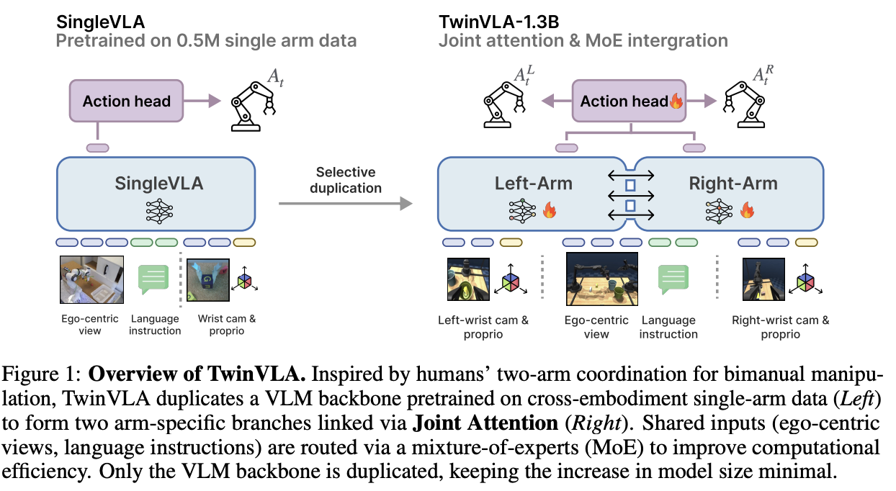
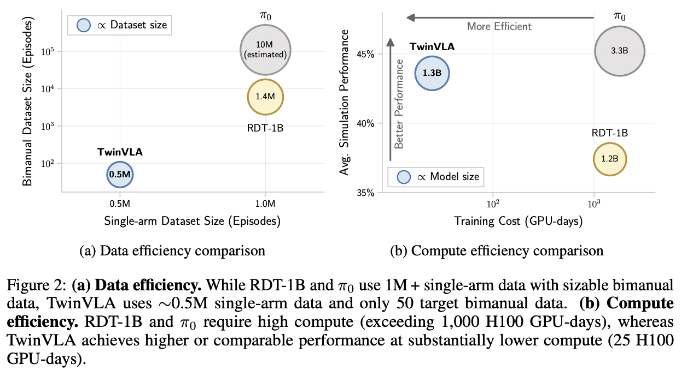
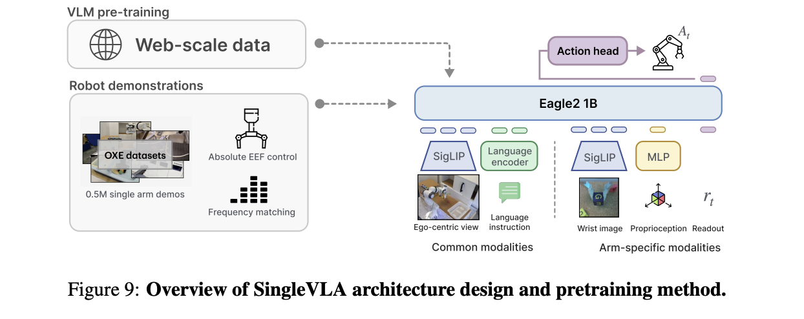
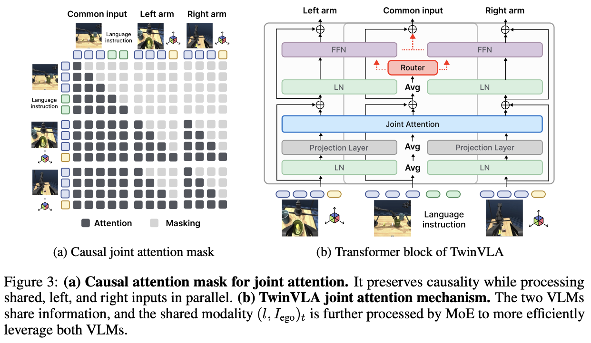
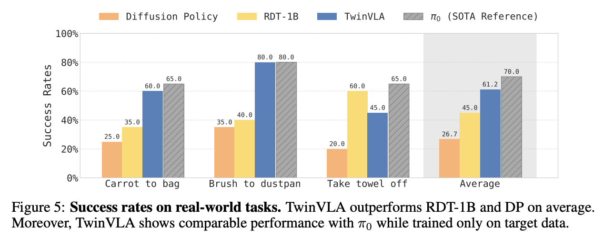
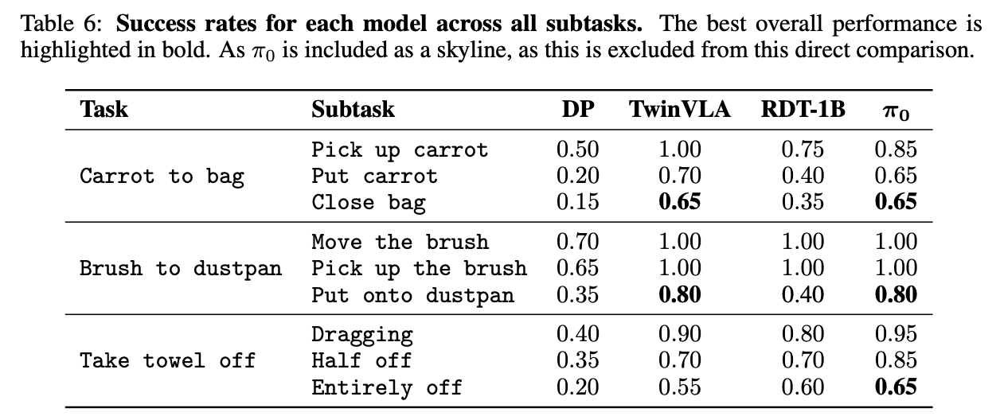
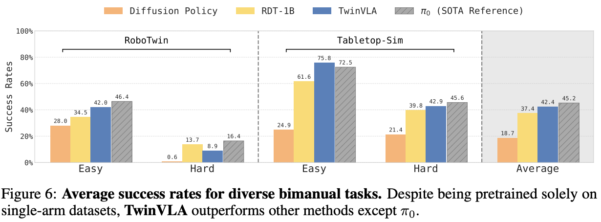
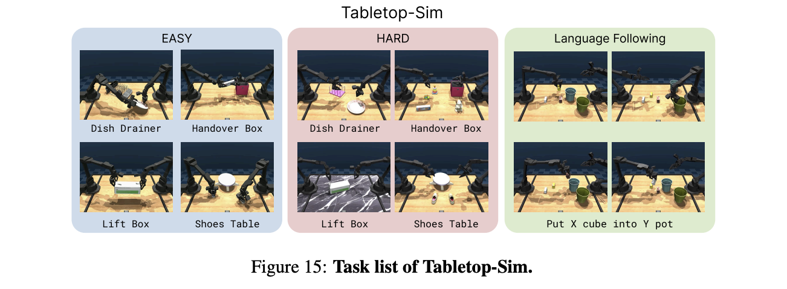
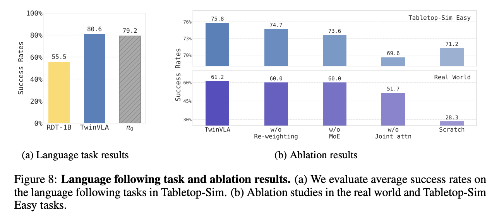

a# TwinVLA

**TwinVLA: Data-Efficient Bimanual Manipulation with Twin Single-Arm Vision-Language-Action Models  [2025.11.7]**

([arXiv](https://arxiv.org/pdf/2511.05275))

### 简介

TwinVLA 用 两个预训练单臂 VLA 的模块化拼装 + 轻量跨臂协调（joint attention）+ 共享输入 MoE，在几乎不需要双臂大规模预训练数据的前提下，仅用少量目标双臂演示（≈50 demos）完成双臂任务微调，性能接近甚至局部超过重数据或者是重算力路线，并把算力与数据门槛显著拉低



### 解决的问题

- 双臂任务本质是**强耦合控制**：两只手的动作空间相互制约，时序上还要协作，比如递交、对齐、拉扯、展开

- 高质量双臂数据难以采集：公开双臂数据稀缺；很多 SOTA 依赖**大量私有双臂数据**与昂贵训练预算，导致可复现性和普及度差

**不再从零训练一个单体双臂大模型，而是最大化复用公开的单臂数据与单臂能力，用极少双臂数据就获得强双臂策略**

### 方法

#### TwinVLA 从一个预训练单臂策略 SingleVLA 变成双臂的策略：

- **选择性复制**：复制高层决策 VLM backbone，共享视觉编码器 + 动作头

- **跨臂联合注意力**：让左右臂 token 在保因果的前提下交换信息，实现跨臂协调

- **共享输入的 MoE**：对语言与自我感知等共享模态避免双份冗余计算，降低 token 长度与显存



TwinVLA 用约 0.5M 单臂数据 + 50 双臂目标数据；训练成本约 25 H100 GPU-days

#### 单臂观测：

 $o^{single}_t = ((l, I^{ego})_t, (I^{wrist}, d)_t)$

其中语言 $(l)$ 与 ego 相机 $(I^{ego})$ 是共享输入，wrist 图像 $(I^{wrist})$与本体感觉 $(d)$为臂特定输入

#### 双臂观测：

$o^{twin}_t = ( (l, I^{ego})*t, (I^{R}*{wrist}, d^R)*t, (I^{L}*{wrist}, d^L)_t )$

#### 输出：

预测长度为 $(T)$的 action chunk，双臂输出为 $((A^R_t, A^L_t))$

#### Conditional Flow Matching（动作头训练的核心）

论文中使用**conditional flow matching**训练连续动作生成头，并在推理时用 Euler 积分采样：

$\mathcal{L}^T(\theta)=\mathbb{E}_{p(A_t|o_t),q(A_t^\tau|A_t)}\|v_\theta(A_t^\tau,h_t,d_t)-\mathbf{u}(A_t^\tau\mid A_t)\|^2,$

Loss: 训练 action head 去拟合从噪声动作到目标动作的参考流

推理：从 $(A_0 \sim \mathcal{N}(0,I))$ 出发，做 $(n=10)$步 Euler 更新

```Comment
这等价于把高维连续动作chunk当作生成建模对象
好处是更强的多峰表达与更平滑的轨迹
代价是推理要做多步采样、且 chunk 长度/频率对真实机器人很敏感
（论文也在后面强调了 frequency matching）
```

### SingleVLA

TwinVLA 的结构本质是复制 VLM backbone

如果底座像 OpenVLA 这类 7B 规模，复制两份会直接把工程与算力打爆,论文因此设计了紧凑的 SingleVLA

作者在最后选择 **Eagle2-1B**：在较少参数下有相当/更好效果且推理更快



#### 单臂预训练数据&&动作空间统一

使用OXE 子集 **0.5M trajectories**作为预训练数据，将各数据集动作统一为**绝对末端执行器（absolute EEF）位姿控制**，旋转用 6D 表示，得到**10D action space**

将不同控制频率的数据**统一重采样到 20Hz**，避免固定 chunk 长度在不同数据集对应不同真实时间跨度带来的错配【Frequency matching】

##### 单臂能力验证

在 LIBERO 上，预训练后的 SingleVLA 平均 **86.0%** ，超过 OpenVLA（76.5%）与 Octo（75.1%）。这点很关键：TwinVLA 的上限很大程度取决于单臂底座强不强

##### 训练代价

- SingleVLA：120k steps，约 5 天，5×H100。
- TwinVLA 微调：约 2 天，1×L40S（40GB）

‍

### TwinVLA详解

##### **双臂共享vision encoder + DiT action head,复制VLM backbone左右臂各一份**

```Comment
视觉表征与低层动作解码在具身层面上大致无关，适合共享
而从观测到动作决策的高层语义 和 策略部分更需要专门化
TwinVLA 总规模约1.3B，与 RDT-1B（1.2B）同量级
```

‍

‍

##### 协调的核心: 跨臂联合注意力

**不是简单 cross-attn，而是共享 self-attention 的联合计算**

每个模态或分支有自己的投影层，但 attention 在全 token 上联合算，再各自投影回去

每个臂内部仍是 lower-triangular（自回归因果），共享模态（语言 + ego）对两臂完全可访问，实现了对称跨臂交互且不破坏自回归约束



```Comment
这相当于给“两个专门化策略”提供一个受控的信息瓶颈，在每层或者若干层让它们交换中间表征
从而学到何时同步（同时抓/同时拉），何时分工（一个固定/一个操作），何时交接（handover）
并且不会像单体大模型那样在训练时被迫用一个参数集合同时兼容左右臂的细粒度差异
```

##### MoE：解决共享输入重复算两遍的算力浪费

共享模态（语言、ego-view）如果在左右两份 VLM 都完整走一遍，会导致 token 与 VRAM 膨胀，论文用 MoE 思路来路由共享 token：

把两份 VLM 的 FFN 当作两个 experts，由 gating 学习共享输入该由谁处理、比例多少，对 layernorm、projection 等非 FFN 部件，用 task arithmetic$(\lambda=0.5)$输出平均等手段整合，模拟共享层但不直接平均参数

这样可以支持在单张 40GB GPU 上 batch size=8 训练

##### Attention re-weighting：一个迁移技巧

复制出第二套臂特定 token 后，会改变注意力分配：共享 token 被稀释，导致从单臂预训练到双臂微调出现输入分布偏移，论文中在 attention score 之后，把**共享模态 token 的 attention weights 翻倍**，再归一化，使其接近预训练时的共享/私有比例

这使得初始微调 loss 下降约 **40%**

### 数据流分析

##### 输入（t 时刻）

$- 语言指令 (l)$  
$- ego 相机图像 (I^{ego}_t)（共享）$  
$- 左腕相机 (I^{L}_{wrist,t}) + 本体 (d^L_t)$  
$- 右腕相机 (I^{R}_{wrist,t}) + 本体 (d^R_t)$

##### 编码与 tokenization

$- 语言 tokenizer → language tokens$  
$- 视觉 encoder（共享）→ 图像 tokens$  
$- proprio MLP → proprio tokens$  
$- 追加 readout token (r_t) 作为动作读出位$

##### Twin VLM 前向（两条分支 + joint attention）

$- 左右臂各自处理臂特定 tokens$  
$- 共享模态 tokens 经过 MoE 路由减少重复$  
$- joint attention 在两臂 token 间交换信息并保持因果性$

##### 得到两臂 readout hidden states

$从最终层读出 (h^L_t, h^R_t)$

##### 共享 DiT action head 用 conditional flow matching 采样动作 chunk

$- 生成 (A^L_t, A^R_t)（连续动作 chunk）$  
$- Euler 采样步数 (n=10)$

##### 动作空间与控制频率一致性

$- 单臂动作采用 absolute EEF pose + 6D rotation（10D）$  
$- 预训练阶段把数据 resample 到 20Hz以对齐 chunk 的真实时间含义$

### 实验分析

#### 对比方法

- **RDT-1B**：直接对标的同量级（≈1.2B）单体双臂路线
- **π0**：3.3B 的 SOTA 参考线（skylines），依赖大量私有机器人数据与高算力、
- **Diffusion Policy** ：271M，小数据下的强基线，用于凸显预训练/大模型结构的收益

此外，论文强调了公平性：各方法 fine-tune steps 与 batch size 对齐，并修正 LeRobot 评测脚本的图像归一化问题

#### 真实机器人：三项长时序桌面双臂任务

**平台**：Anubis 双臂机器人（每臂 6DoF + 平行夹爪），双腕相机 + 中央 ego 相机

**任务**：carrot to bag、brush to dustpan、take towel off。每个任务收集 **50 episodes**，每方法每任务微调后做 **20 rollouts**

**总体成功率**



**子任务瓶颈**

- carrot to bag 的瓶颈在把胡萝卜放进袋子并准确开口或者合口
- brush to dustpan 的瓶颈是高精度插入
- towel off 的瓶颈是后段的跨臂切换与展开



```Comment
TwinVLA 在需要精细对齐 + 双臂协作的任务表现非常强
说明 joint attention 的跨臂信息融合确实在发挥作用
但在 towel off 上落后于 RDT（45 vs 60）
论文在定性分析里指出一个可能原因：
RDT/π0 的更长 action chunk有助于跨越多模态和长时序的不确定性
TwinVLA 反而会重复同一动作卡住
```

#### 仿真

##### RoboTwin 2.0（50 个双臂任务）

- 训练：每任务 fine-tune **50 demos**
- 测试：每任务在 Easy/Hard 各 **100 rollouts**
- Easy：测试场景与训练一致但语言指令新；Hard：引入纹理/物体位置/高度变化等



```Comment
TwinVLA 在 RoboTwin-Hard 上不如 RDT，这揭示了 modular-transfer 的边界：
当环境分布偏移 + 任务多样化更强时，缺乏双臂大规模预训练的模型会更吃亏
作者没有回避这一点，反而用后续的鲁棒性分析解释差距
```

##### Tabletop-Sim



- 基于 dm\_control，并结合 ALOHA2、GSO 等资产；包含 4 个单任务 + 1 个多任务语言跟随设置
- 每个单任务收集 50 demos，多任务收集 60 demos，并设置 Easy/Hard 两档（Hard 有纹理、物体模型、干扰物变化）
- 作者表示将开源此仿真与数据集



#### 数据效率：只要 50 demos 就追上并且超过强基线

作者在 Tabletop-Sim Easy 上用 20/35/50 demos 做微调比较，TwinVLA 曲线陡峭，50 demos 就超过 RDT

```Comment
这说明 TwinVLA 的结构确实带来一种强 inductive bias：
它不需要学会单臂技能，而是主要在学怎么让两只手协作,因此少量双臂数据就能明显提升
```

#### 语言跟随（Language Following）

在 Put X cube into Y pot 语言组合任务上：

- RDT-1B：55.5
- TwinVLA：80.6
- π0：79.2

```Comment
很多机器人 VLA 在机器人数据微调后会语言能力退化，变成只看视觉不看指令
TwinVLA 在该测试上明显更强，论文认为得益于有效保留了单臂预训练获得的语言和视觉知识
```

#### Robustness

在 Tabletop-Sim Hard，TwinVLA 相比 RDT-1B 仍有优势（论文提到 3.3%）

在 RoboTwin Easy，TwinVLA 比 RDT-1B 高 7.48%；Hard 略低 3.72%，但仍显著优于无预训练的 DP

### 局限与价值（个人向）

```Comment
我认为的局限：
因为 TwinVLA 是把单臂表征迁移到双臂任务，双臂微调可能导致对单臂技能的遗忘
真实机器人 towel-off 定性分析显示，较长 chunk 可能对跨越多模态不确定性有帮助，TwinVLA 在这点上出现重复动作问题
```

```Comment
实际价值：
双臂数据采集成本断崖式下降：只要能拿到公开单臂数据并训练或者拿到一个强 SingleVLA，然后收集约 50 条目标双臂演示，就能做有竞争力的双臂策略
可复现：MoE + 输出平均等工程处理让 TwinVLA 能 batch=8 在单张 40GB GPU 上训练，TwinVLA 微调甚至在 1×L40S 上约 2 天完成
我认为这篇论文最有前途的不是某个具体数字，而是结构范式：
把跨臂协调作为独立问题来学，而不是强迫单体大模型在一个参数空间里同时学会两臂技能与协调规律
这种思想可以迁移到：多臂、移动操作、甚至多机器人协作，论文结尾也明确提到可拓展到更复杂机器人领域
```

‍